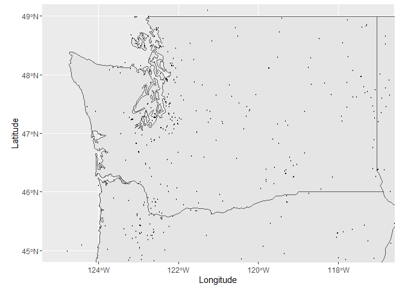
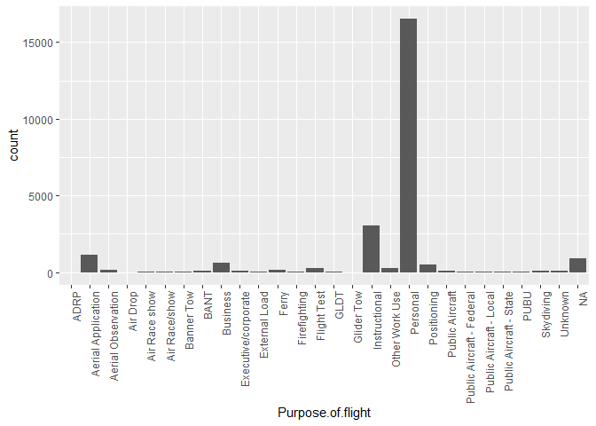

NTSB Aviation Data - Exploratory Data Analysis
================
Team 9
2023-02-20

# Intro/Explanation

Exploratory data analysis (EDA) is a process of examining and analyzing
data to extract insights and identify patterns. In this case, we have a
dataset of aircraft incidents which have been reported around the Globe.
For our purposes, however, we need to filter it down to United States
only. Here are some steps for conducting an EDA on this dataset:

Check the data types and missing values:

First, we should check the data types of each column to make sure they
are correct. We can also check if there are any missing values in the
dataset. Explore the distributions of the numerical columns:

We can use histograms or box plots to visualize the distributions of the
numerical columns (Latitude and Longitude). This can help us understand
the range of values and identify any potential outliers.

Explore the categorical columns:

We can create bar charts or pie charts to visualize the frequency
distribution of the categorical columns (ICAO.Code, IATA.Code,
Airport.Name, City, and Country). This can help us understand the
distribution of airports across different regions.

Look for correlations:

We can use scatter plots or correlation matrices to identify any
correlations between the numerical columns (Latitude and Longitude).
This can help us understand the relationships between the variables and
identify any potential patterns.

Identify any potential outliers or anomalies:

We can use box plots or scatter plots to identify any potential outliers
or anomalies in the data. This can help us understand if there are any
unusual values that might be errors or require further investigation.

Compare airports:

We can create separate visualizations for the airports to compare their
distributions and identify any differences or similarities.

Overall, an EDA can help us understand the characteristics of the
dataset and identify any potential issues or opportunities for further
analysis.

# Data Cleaning/Reformatting

Before doing any analysis on our dataset, we altered the table to remove
null values and filter the data for a number of specifications given by
our liason. We also changed the granularity of several columns for
analysis purposes later on.

## Changelog:

-Store only US data

-Store only data from post 2001

-Store only data about Airplanes

-Remove na values from make and model (DROPS about 20 rows)

-Remove aircraft which have been designated as commercial aircraft
(using additional dataset)

-Remove aircraft with 40 or more passengers total (Counting inj,
non-inj)

-Fill na values for long, lat using Global Airport Database csv
-Reformat \$Location to include city name and country

-Remove Columns (Publication.Date, Schedule, Accident.Number,
Registration.Number, Air.carrier, Investigation.Type)

-Reformat Amateur.built column to “Y/N” format -Remove Nulls from
Amateur.built column

-Remove Nulls and unknown values from Aircraft.damage column

-Remove Nulls and unknown from Engine.Type column

-Calculate severity index rating for each indedent and then calculate
rating for each US airport that is in the dataset

-Reformat Event.Date to include Year and Month as seperate columns

-Export Final Cleaned Data Set

# Exploratory Data Analysis

Now that the dataset is cleaned/formatted in a manageable format, EDA
can begin.

We start by comparing the different categorical vs continuous variables
in our dataset using a correlation matrix. Larger circles indicate
strong correlation, red means negative correlation, blue means positive.

## Correlation Matrix

<!-- -->

From a quick glance at the correlation matrix above, Weather condition
has a strong correlation to total Fatal injuries, as well as aircraft
damage. SIR has a high relation to Total Fatal injuries, which makes
sense because the Severity index rating is highly influenced by fatal
injuries in the equation.

## Accident Hotspot Map

Next, we will compare incident severity/count by location using a
heatmap of the United States to identify trends and key locations where
accidents have occured using primarily longitude/latitude.

<!-- -->

This initial hotspot map shows us that there are accident hotspots in
major metropolitan areas across the United States. Some of the big
hotspots of accidents along the west coast are in Seattle, Portland, the
Bay Area and generally, southern California. We can also see some big
hotspots in Chicago, the New York/New Jersey area and all over southern
Florida.

<!-- -->

When taking a look at California individually we can see a significant
cluster in the greater los angeles area.

<!-- -->

Florida has incidents spread all across the state, with a small hotspot
in the Miami area.

<!-- -->

Here we can see more incidents clustered around the puget sound in
Washington.

## Counts of Key Variables

Next, we will dive further into our exploratory analysis by visualizing
the number of accidents against different key variables to get an
understanding of which variables may be significant.

<!-- --><!-- -->

From the above plots we can see that the majority of incidents resulted
in non-fatal injuries and substantial aircraft damage.

<!-- -->

The majority of airplanes were not amateur built, with roughtly 7,500
aircraft built by an amateur.

<!-- --><!-- -->

A substantial majority of incidents occurred in airplanes with a
reciprocating engine and in airplanes with only one engine. These
results are as expected since most small aircraft have 1 reciprocating
engine.

<!-- -->

In this plot we can see that most incidents occured during either
takeoff or landing.

<!-- -->

Here we see that most incidents occurred when the airplane was being
used for personal use.

## Weather vs Fatal Injuries

Next, we will take a look at how weather affects the number of fatal
injuries.

<!-- -->

During the times that caused fatalities you can see that the pilots used
IMC had a higher fatality than pilots that were controlling the plan
themselves. In this case, was the error cased by the weather conditions
or was it caused by pilot error or instrument error?

<!-- -->

The weather conditions can have a major effect on flights. As you can
see during the times that pilots were controlling the
instrument(Aircraft) they had more unijured passengers compared to
flights that were controlled by the instrument. When the insturment was
being controlled by the pilot you can see that 75% were uninjured during
the accident. However, when the instrument controlled itself almost 50%
where fatalities.

<!-- -->

As you can see based on the information the weather conditions were
analyzed as IMC and VMC. These are terms that are used when describing
the weather conditions during flights. VMC means that during flight
pilots have visibility and can rely on them to control the plane. IMC
means that pilots need to rely on the plane(instrument) to control the
flight. As you can see that data that was pulled shows years 2002 to
2007 had information on the type of weather that was presented during
the accidents. Out of the years pilots maintained the VMC for most of
the flights and during 2005-2006 the weather had shifted to where they
had to use IMC.

<!-- -->

During the many different phases of flights, you can see that VMC is the
primary condition. However, during the option listed as other and
unknown in the reports seem to be the highest. During takoff,
maneuvering, approach and climb, you can see that they did require the
instrument (airplane) to take control because of the weather conditions.

## Aircraft Characteristics vs Severity

Since a large amount of incidents occur with commercial aircraft, we
will look at measurements of incident severity by manufacturer.
<!-- --> Beech, Cirrus,
and Mooney tend to have more frequently severe accidents than other
manufacturers.

# Conclusion/Findings

Through this exploratory data analysis we found the below patterns in
the dataset.

- A majority of accidents occur in major population centers.

- Weather condition has a high influence on both fatality rate and
  aircraft damage.

- Amateur built aircraft tend to have fewer engines, and surprisingly
  less fatal incidents.

- A vast majority of incidents have no fatal injuries.

- Most incidents involved planes which were commercial built.

- Most incidents occur during takeoff/landing.

- Incidents involving Takeoffs/Landings/Maneuverings typically have more
  adverse weather conditions. During IMC, instruments are used to pilot
  the aircraft, which is more difficult during these phases of flight.

- Beech, Cirrus, and Mooney tend to have more frequently severe
  accidents than other manufacturers.
